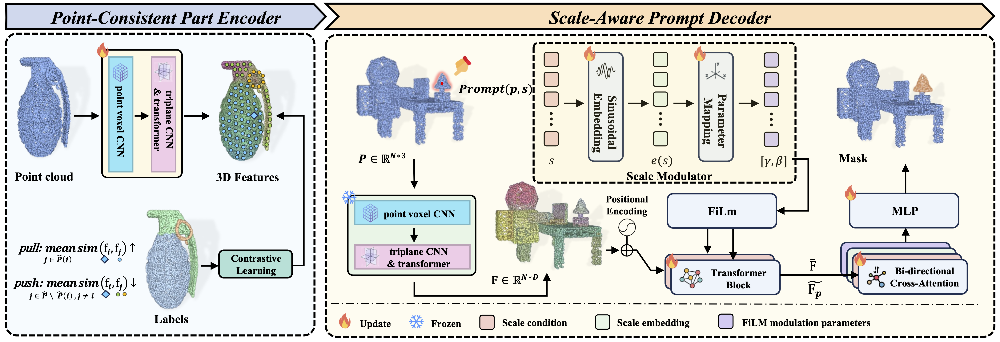

<div align="center">

# S²AM3D: Scale-controllable Part Segmentation of 3D Point Clouds

[](https://arxiv.org/abs/2512.00995)
[](https://sumuru789.github.io/S2AM3D-website/)
[](https://huggingface.co/HITshan/S2AM3D)
[](https://huggingface.co/datasets/HITshan/S2AM3D_dataset)

**Han Su, Tianyu Huang, Zichen Wan, Xiaohe Wu, Wangmeng Zuo***

Harbin Institute of Technology

</div>

---

<div align="center">
  
</div>

## Abstract

Part-level point cloud segmentation has recently attracted significant attention in 3D computer vision. Nevertheless, existing research is constrained by two major challenges: native 3D models lack generalization due to data scarcity, while introducing 2D pre-trained knowledge often leads to inconsistent segmentation results across different views.

To address these challenges, we propose **S²AM3D**, which incorporates 2D segmentation priors with 3D consistent supervision. We design a *point-consistent part encoder* that aggregates multi-view 2D features through native 3D contrastive learning, producing globally consistent point features. A *scale-aware prompt decoder* is then proposed to enable real-time adjustment of segmentation granularity via continuous scale signals. Simultaneously, we introduce a large-scale, high-quality part-level point cloud dataset with more than 100k samples, providing ample supervision signals for model training.

Extensive experiments demonstrate that S²AM3D achieves leading performance across multiple evaluation settings, exhibiting exceptional robustness and controllability when handling complex structures and parts with significant size variations.

---

## 🔗 Links

| Resource | Link |
|:--------:|:----:|
| 📄 Paper | [arXiv:2512.00995](https://arxiv.org/abs/2512.00995) |
| 🌐 Project Page | [S2AM3D Website](https://sumuru789.github.io/S2AM3D-website/) |
| 🤗 Pretrained Models | [Hugging Face](https://huggingface.co/HITshan/S2AM3D) |
| 📦 Dataset | [Hugging Face Datasets](https://huggingface.co/datasets/HITshan/S2AM3D_dataset) |

---

## 📥 Pretrained Models

Download the pretrained models from [Hugging Face](https://huggingface.co/HITshan/S2AM3D) and place them in the `ckpt/` folder:

```bash
mkdir -p ckpt
# Download the following files and place them in ckpt/
# - Encoder.ckpt
# - S2AM3D_decoder.pt
```

Your directory structure should look like:
```
S2AM3D/
├── ckpt/
│   ├── Encoder.ckpt
│   └── S2AM3D_decoder.pt
├── decoder/
├── encoder/
├── demo/
└── ...
```

---

## 🛠️ Installation

### Option 1: Using environment.yml (Recommended)

```bash
conda env create -f environment.yml
conda activate s2am3d
```

### Option 2: Manual Installation

```bash
# Create conda environment
conda create -n s2am3d python=3.10
conda activate s2am3d

# Install CUDA
conda install nvidia/label/cuda-12.4.0::cuda

# Install PyTorch
pip install torch==2.4.0 torchvision==0.19.0 torchaudio==2.4.0 --index-url https://download.pytorch.org/whl/cu124

# Install core dependencies
pip install psutil
pip install lightning==2.2 h5py yacs trimesh scikit-image loguru boto3
pip install omegaconf viser

# Install additional packages
pip install mesh2sdf tetgen pymeshlab plyfile einops libigl polyscope potpourri3d simple_parsing arrgh open3d

# Install torch-scatter
pip install torch-scatter -f https://data.pyg.org/whl/torch-2.4.0+cu124.html

# Install system dependencies (Ubuntu/Debian)
apt install libx11-6 libgl1 libxrender1

# Install VTK
pip install vtk
```

---

## 🚀 Quick Start

### Interactive Demo

Run the interactive segmentation demo:

```bash
cd decoder
bash run_interactive_demo.sh
```

After the server starts, open your browser and navigate to:
```
http://localhost:8080
```

The demo provides:
- **Point cloud visualization** with interactive controls
- **Click-based prompt selection** for segmentation
- **Scale adjustment** slider for controlling segmentation granularity
- **Feature visualization** mode

---

## 📊 Dataset

<div align="center">
  
</div>

Using an automated data processing pipeline, we collect a dataset of over **100,000** point cloud instances spanning **400** categories, annotated with approximately **1.2 million** fine-grained part labels.

### Download

Download the dataset from [Hugging Face Datasets](https://huggingface.co/datasets/HITshan/S2AM3D_dataset).

---

## 📝 TODO

- [ ] Release training code
- [ ] Release evaluation code
- [ ] Support more input formats

---

## 📖 Citation

If you find this work useful, please consider citing:

```bibtex
@article{su2025s2am3d,
    author = {Su, Han and Huang, Tianyu and Wan, Zichen and Wu, Xiaohe and Zuo, Wangmeng},
    title = {S²AM3D: Scale-controllable Part Segmentation of 3D Point Cloud},
    journal = {arXiv preprint arXiv:2512.00995},
    year = {2025},
}
```

---

## 🙏 Acknowledgements

This project is built upon and inspired by the following excellent works:

- [PartField](https://github.com/nv-tlabs/PartField) - Neural implicit representation for part segmentation
- [OpenShape](https://github.com/Colin97/OpenShape_code) - Open-vocabulary 3D shape understanding
- [Segment Anything](https://github.com/facebookresearch/segment-anything) - Foundation model for image segmentation

We thank the authors for their outstanding contributions to the community.

---

<div align="center">
  <p>If you have any questions, please feel free to open an issue or contact us.</p>
</div>

